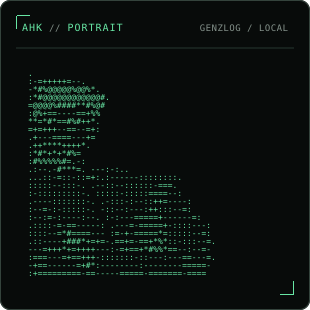
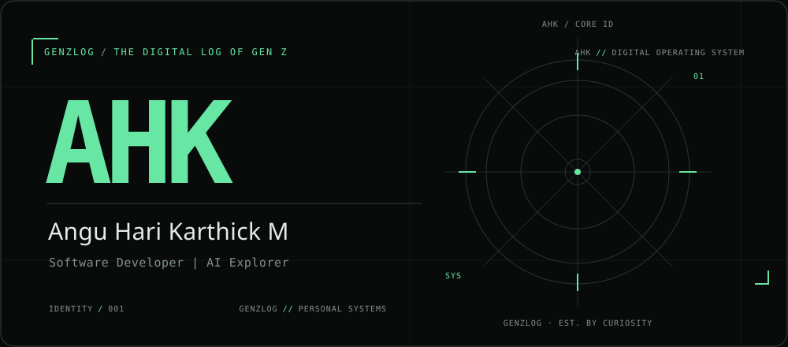
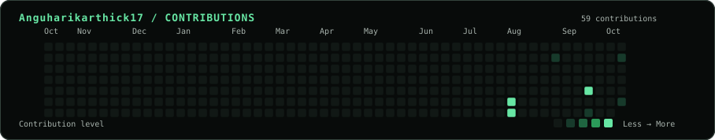

# `AHK` // Angu Hari Karthick M

**Software Developer | AI Explorer**

**GENZLOG** — The Digital Log of Gen Z

## `~/about`

Second-year undergraduate student passionate about software development, artificial intelligence, and building creative digital experiences.

## `~/focus`

Software Development · Artificial Intelligence · Web Development · Creative Technology · Gaming and Esports

Currently building: Personal software projects · GENZLOG - Creative Technology Brand

## `~/profile`

## `~/activity`

Generated from the GitHub contribution calendar for `Anguharikarthick17`. Colors represent GitHub contribution levels; the SVG title on each day provides its date and exact count. Some configured repositories may be private or otherwise return 404 to anonymous visitors. The project names and configured URLs are retained; verify visibility in GitHub if a link is inaccessible.

## `~/projects`

- [EcoRoute](https://github.com/Anguharikarthick17/EcoRoute) — A software project focused on eco-friendly routing.
- [AudienceIQ](https://github.com/Anguharikarthick17/AudienceIQ) — A project exploring audience intelligence.
- [BlackBox---Ai](https://github.com/Anguharikarthick17/BlackBox---Ai) — An AI-related software project.
- [CHESS-GAME](https://github.com/Anguharikarthick17/CHESS-GAME) — A chess game project.
- [AHK-MINI](https://github.com/Anguharikarthick17/AHK-MINI) — A personal software project.
- [AHK-DYNAMIC-ISLAND](https://github.com/Anguharikarthick17/AHK-DYNAMIC-ISLAND) — A personal interface project.
- [AHK-RESUME](https://github.com/Anguharikarthick17/AHK-RESUME) — A resume-related project.
- [MAIN-PORTFOLIO](https://github.com/Anguharikarthick17/MAIN-PORTFOLIO) — A portfolio project.
- [AHK-KEYCHAIN](https://github.com/Anguharikarthick17/AHK-KEYCHAIN) — A keychain project.
- [DATA-SENTINEL](https://github.com/Anguharikarthick17/DATA-SENTINEL) — A data sentinel project.
- [RESUMEFIT](https://github.com/Anguharikarthick17/RESUMEFIT) — A resume-fit project.
- [UNIGUARD-AI](https://github.com/Anguharikarthick17/UNIGUARD-AI) — A UniGuard AI project.
- [Word-Build](https://github.com/Anguharikarthick17/Word-Build) — A word-building project.
- [Portfolio-Sample](https://github.com/Anguharikarthick17/Portfolio-Sample) — A sample portfolio project.
- [Dodge-Game](https://github.com/Anguharikarthick17/Dodge-Game) — A dodge game project.
- [Road-Safety](https://github.com/Anguharikarthick17/Road-Safety) — A road safety project.
- [AI-AGRI-PROJECT](https://github.com/Anguharikarthick17/AI-AGRI-PROJECT) — An AI agriculture project.
- [FIXNOW-PORTEL---VIT](https://github.com/Anguharikarthick17/FIXNOW-PORTEL---VIT) — A FixNow portal project.
- [Love-Calculator](https://github.com/Anguharikarthick17/Love-Calculator) — A love calculator project.

## `~/stack`

Languages: `Python` · `JavaScript` · `HTML` · `CSS` · `TypeScript`

Tools: `Git` · `GitHub` · `GitHub Actions` · `Visual Studio Code`

## `~/links`

- [GitHub](https://github.com/Anguharikarthick17)
- [LinkedIn](https://www.linkedin.com/in/angu-hari-karthick-m-175753374)
- [Instagram](https://www.instagram.com/angu.hk/)

<code>GENZLOG</code> // curious by design

